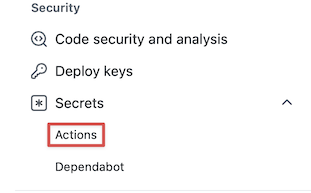

# Spacelift Run Signature Reference Implementation

This repository shows how to sign Spacelift runs with a GitHub Action and have the signature verified by a private worker pool before the run gets executed.

Since you manage both the GitHub account and the private worker pool, you can verify that the run has not been tampered with by Spacelift or anyone else on the path.

## Overview

This reference implementation uses a few components:

- A [Spacelift Push policy](https://docs.spacelift.io/concepts/policy/git-push-policy) to prevent runs from being triggered automatically on code change pushes.
- A [GitHub Action](./trigger-spacelift-signed-run.yml) to sign and trigger the run on code change pushes.
- A [Spacelift Initialization policy](https://docs.spacelift.io/concepts/policy/run-initialization-policy) to verify the signature before executing the run on a private worker pool.

The workflow is as follows:

- A user pushes a code change to GitHub.
- Spacelift is notified but ignores the code change push because of the Push policy.
- The GitHub Action is triggered. It builds a JWT token and signs it with your secret. Then, it triggers a run and passes the signed token as metadata.
- Spacelift schedules the run onto the private worker pool configured for the stack.
- The private worker pool launcher evaluates the Initialization policy to verify the signature, that the token has not expired and is associated with the stack and commit for the run.
- If the token validation succeeds, the launcher starts the worker, and the run gets executed. Otherwise, the worker does not get started, the run is marked as failed, and the reason for the failure is displayed in the Initialization phase logs.

## Requirements

- The code must be stored in GitHub. Please note that [monorepositories](https://en.wikipedia.org/wiki/Monorepo) are not supported by this reference implementation at this time.
- The Spacelift account must be able to run private worker pools.

## Installation

### Configure the Spacelift account

- [Create a Push policy](https://docs.spacelift.io/concepts/policy#creating-policies) using the [provided policy body](./push-policy.rego).
- [Create the private worker pool](https://docs.spacelift.io/concepts/worker-pools#setting-up) and save the token you will receive from Spacelift and the key you used.

### Configure the Spacelift stack

- [Attach the Push policy](https://docs.spacelift.io/concepts/policy#attaching-policies) you just created to the stack.
- [Have the stack use the private worker pool](https://docs.spacelift.io/concepts/worker-pools#using-worker-pools).

### Get a Spacelift API key

You can use an existing Spacelift API key, but we recommend using a dedicated key for improved security.

- On your Spacelift account "Settings" page and select the "API Keys" tab.
- Click on the "Add New API Key" button.
- Give the new API key a name (e.g., `GitHub Actions`).
- Turn the "Admin" toggle on.
- Click on the "Add Key" button.
- Your browser will download a file with the secret for this API key. Save it as you will need it later.
- You will see the ID for the newly created key on the API key list. Save it as you will need it later.

### Configure the GitHub repository

- In your GitHub repository, create a `.github/workflows` folder if it does not exist yet.
- Copy the [`trigger-spacelift-signed-run.yml`](./trigger-spacelift-signed-run.yml) file from this repository into the `.github/workflows` folder in your repository.
- Go to your GitHub repository Settings page and select "Secrets/Actions".

- Click on the "New repository secret" button to add secrets.

- You will need to add the following secrets in GitHub:
  - `SPACELIFT_API_ENDPOINT`: The URL for your Spacelift account (e.g., `https://acme.app.spacelift.io/`).
  - `SPACELIFT_API_KEY_ID`: The Spacelift API key ID that you saved earlier.
  - `SPACELIFT_API_KEY_SECRET`: The Spacelift API key secret from the file that you downloaded earlier.
  - `SPACELIFT_RUN_SIGNATURE_SECRET`: The secret that will be used to sign the JWT token. It can be any string.
  - `SPACELIFT_STACK_ID`: The ID for the Spacelift stack associated with the GitHub repository.

### Configure the private worker pool

- Copy the [Initialization policy](./initialization-policy.rego) locally on the server where the worker pool launcher is installed.
- Edit the policy to replace the `${SECRET}` placeholder with the secret you set in GitHub as `SPACELIFT_RUN_SIGNATURE_SECRET`.
- Set the `SPACELIFT_LAUNCHER_RUN_INITIALIZATION_POLICY` to the path to the Initialization policy.
- Start the private worker pool launcher.

## Known Limitations

- This implementation does not currently support monorepos.
- Currently, the secret used to sign the runs has to be hardcoded into the Initialization policy. This is not ideal from a maintenance standpoint, but since you manage the policy and the server on which it is stored, there should not be any security issue.
